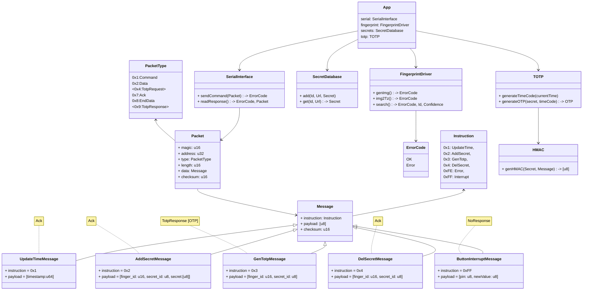

# Rust Project Template

## Setup CI/CD

Open Github Settings -> Actions -> General -> Workflow permissions: Read / Write
Open Github Settings -> Pagtes -> Source -> gh-pages branch

## Local Development

```bash

# Install Rust
curl --proto '=https' --tlsv1.2 -sSf https://sh.rustup.rs | sh

rustup install
# or
rustup update

# list configured commands
make help
```

## Architecture

- [ ] secret storage on device or on computer?
- [ ] multiple totp sources per user?


